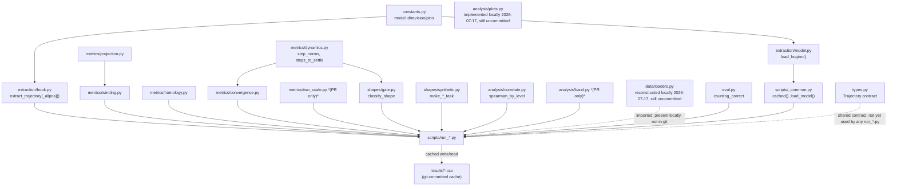

# Code infrastructure — architecture, conventions, cookbook

> **STALE AS OF 2026-07-24** — architecture/conventions described below are
> probably still accurate, but this predates several new modules and
> functions added since (`multivariate_rank_control`, `benjamini_hochberg`
> usage, `run_fdr_correction.py`, `run_power_analysis.py`,
> `make_three_scale_modk_task`, the `diag_*.py` one-off-diagnostic
> convention). See `architecture_state.md` (kept current, not this file)
> for the up-to-date module/results inventory, and
> `docs/verifiability_and_accountability.md`. Not rewritten, just flagged.

Distinct from the other three docs in here: `research_log.md` is the
discussion trace, `guide.md` is "how do I set up and reproduce this,"
`claims_ledger.md` is "is this specific number true." This one is the
architecture — module dependency structure, the team conventions baked into
the code, and a cookbook for extending it. All figures below were extracted
with grep/git, not estimated.

## 1. Module dependency graph



Three concentric layers, by GPU/model dependency:

1. **Model-bound** (needs CUDA + the `model` extra): `extraction/model.py`,
   `extraction/hook.py`, `eval.py`. Nothing else touches `torch` or
   `transformers` directly — imports of these are always deferred (`from
   traj_geom.extraction.hook import extract_trajectory` *inside* `compute()`
   functions, never at module top of a metric/shape/analysis file) so that
   importing the rest of the package never requires a GPU or even `torch`
   installed.
2. **Pure numpy/scipy/sklearn, model-free** (everything in `metrics/`,
   `shapes/`, `analysis/`, `types.py`): operates on a plain `[T, hidden_dim]`
   (or `[T, seq_len, hidden_dim]`) array. **Correction, 2026-07-18: "fully-
   tested" overclaims this** — roughly half this layer's public functions
   (all of `metrics/dynamics.py`, `winding_of`, `pca_to_2d`, all 4 synthetic-
   task generators, `spearman`/`partial_spearman`) have zero direct tests
   despite needing no GPU, same as the ones that are tested. See
   `research_log.md`'s 2026-07-18 entry.
3. **Glue** (`scripts/run_*.py`, `scripts/_common.py`): the only layer that
   imports across both of the above, and the only layer that talks to
   `results/*.csv`.

`types.py::Trajectory` is worth flagging explicitly: it's described in its
own docstring as "the ONE fully implemented module... every teammate codes
against `Trajectory`," but **no `run_*.py` script actually constructs or
consumes a `Trajectory` object** — every script passes bare numpy arrays
around instead. The dataclass (with its `.save()`/`.load()` npz round-trip,
tested in `test_types.py`) exists and works, but the shared-contract vision
in its docstring isn't actually how the codebase evolved. Not a bug, just a
gap between an early design doc and what got built — worth knowing before
assuming trajectories flow through the codebase as `Trajectory` objects
anywhere except that one test.

## 2. Environment & dependency infra

| Extra | Adds | Needed for |
|---|---|---|
| *(base)* | numpy, scipy, scikit-learn, matplotlib, pandas, tqdm, pyyaml | All CPU-only metrics/shapes/analysis code, and reading cached `results/*.csv` |
| `model` | torch, transformers==4.53.3, accelerate, datasets | Loading Huginn and running `extract_trajectory*` — needs a GPU in practice (`.to("cuda")` is hardcoded, see `guide.md` §3) |
| `tda` | ripser, persim, scipy | `metrics/homology.py` / `run_homology.py` only |
| `dev` | pytest, ruff | Running the test suite / linting — **not installed by plain `uv sync`**, see `guide.md` §5 |

`transformers` is pinned to exactly `4.53.3` (working window documented as
4.50–4.53) with a specific model revision hash
(`bb6621b65e90b6a4b9b29ef88dc83866d450470c`) — both load-bearing, not
cosmetic. `constants.py`'s docstring spells out why, verbatim from
debugging: `4.49-` lacks a `device` arg the custom Huginn code needs,
`4.54+` makes `key_cache` read-only (breaks the custom modeling code),
`5.x` changes tied-weights loading. If you ever bump `transformers` here,
expect the model load itself to break, not a downstream metric.

Python is pinned to `>=3.11,<3.12` (`.python-version` says `3.11` exactly)
project-wide, no stated reason beyond "this is what it was built/tested on."

No CI (no `.github/` directory at all, on any branch), no Dockerfile, no
cloud/notebook infra checked in beyond the two Jupyter notebooks themselves.
GPU compute is manual, on Kaggle (`guide.md` §3) — reproducibility for
anything touching the model depends entirely on someone with Kaggle access
running the relevant `scripts/run_*.py` by hand and committing the resulting
CSV.

## 3. The OWNER convention — and its actual authorship

Every `src/traj_geom/**/*.py` and `scripts/run_*.py` file on `main` opens
with an `OWNER:` tag (plus `STATUS:`, `TASK:`, `I/O:`). Exact counts, grepped
directly:

- **Extraction+Winding** — 13 files: model loading, the hook, winding,
  projection, convergence, homology, dynamics, `run_contrast.py`,
  `run_homology.py`, `run_convergence.py`. The model-facing / core-dynamics
  lane.
- **Data+Analysis** — 12 files: `correlate.py`, `plots.py` (stub), `eval.py`,
  and the majority of experiment scripts (`run_pararule`, `run_dissociation`,
  `run_dissociation_multiinit`, `run_counting`, `run_switch`, `run_maxtask`,
  `run_accuracy`, `run_mvp`). The stats + experiment-orchestration lane —
  also the biggest one.
- **Shapes+Gate** — 5 files: `gate.py`, `synthetic.py`, `run_forceloop.py`,
  `run_phase.py`. The regime-classification + task-design lane.

**Important caveat, checked against actual git blame, not assumed:** on
`main`, every one of these files was written by a single person
(`Shtirmann` — and `Alexander Shiyanov`, the other name in `main`'s history,
is the same person: their commits use GitHub's `@users.noreply.github.com`
address which embeds the `Shtirmann` handle, i.e. that's the same account
committing via the GitHub web UI for two doc-only commits vs the local git
client for everything else). **The three OWNER lanes are the team's intended
division of labor, not a record of who actually built each part** — nobody
but Shtirmann has institutional first-hand knowledge of any of this code
yet, role tags notwithstanding. `jack`'s only contribution (the two-scale
feature branch) doesn't use the OWNER convention consistently — only the
PR's new `analysis/band.py` does (tagged Data+Analysis), matching `main`'s
style; the older `metrics/two_scale.py` functions don't have OWNER headers
at all. If you're picking a lane to start contributing in, all three are
equally "unclaimed" in practice.

## 3b. A real bug in the code the team treats as statistical ground truth

`analysis/correlate.py`'s `_SPEARMAN_CRIT_P05` table (the hardcoded critical
|rho| values `spearman_by_level`/`fmt_by_level` compare against) has a
verified error at N=4: it lists `crit[4]=1.000`, which reads as "achievable
if the correlation is perfect" — but exact permutation enumeration (all 24
possible rank orderings at N=4) shows the smallest possible two-tailed exact
p-value at N=4 is 2/24≈0.083, never below 0.05, for any sample whatsoever.
The correct entry is "n/a — no significant result is possible at this N,"
same as the table already does for N>10. This doesn't currently produce a
false "sig" anywhere in the project (the two N=4 experiments, B1/C5, have
rhos of 0.20-1.00, and the table's threshold is unreachable regardless of
sample), but it's a landmine for any future N=4 experiment. Every other
entry was checked the same way, by exact permutation enumeration at each
N: the N=8 entry (`0.738`) is in fact correct, matching standard published
Spearman critical-value tables — an earlier pass through this table
flagged it as a second bug (claiming the correct value was `0.7143`), but
that flag was itself wrong (`0.7143` gives exact two-tailed p=0.058, not
significant; `0.738` gives p=0.046, which is) and has been withdrawn. N=4
is the table's only real defect. Fix: mark N=4/5 as "n/a" in
`fmt_by_level`'s output, or switch to reporting an actual exact p-value
instead of a binary lookup-table comparison.

## 4. The caching contract — the load-bearing pattern

`scripts/_common.py::cached(name, compute_fn)` is small (20 lines) but it's
the single piece of infrastructure that makes this whole project usable by
more than one person with GPU access:

```python
def cached(name, compute_fn):
    path = RESULTS_DIR / name
    if path.exists():
        return pd.read_csv(path)        # <- no GPU, no model import triggered
    df = compute_fn()                    # <- only reached on a cache miss
    df.to_csv(path, index=False)
    return df
```

Every `run_*.py`'s `compute()` does its `torch`/`transformers` imports
*inside* the function body specifically so that hitting the cache never
imports them. This is why `uv run python -m scripts.run_pararule` (once the
missing loader is fixed, see `guide.md` §5) works with zero GPU as long as
`results/pararule.csv` exists — and why deleting a CSV to force a re-run is
a real GPU-requiring action, not a formality.

Practical implication: **the `results/*.csv` files are the actual dataset of
this project.** Editing a metric's formula after a result was cached does
**not** retroactively change anything — the stale CSV is silently reused
until someone deletes it and reruns with GPU access. There's no hash/version
check tying a cached CSV to the code that produced it. If you change
`metrics/winding.py`, for instance, every `results/*winding*` number is now
stale until manually invalidated.

## 5. Testing infra (see `claims_ledger.md` D1/D2/C9 for current pass/fail state)

Tests exist only for the model-free layer (§1, layer 2): `test_convergence`,
`test_correlate`, `test_gate_synthetic`, `test_homology` (skipped without
`ripser`), `test_types`, `test_winding_synthetic` on `main`; the PR branch
adds `test_two_scale.py` (currently fails to collect — the loaders bug) and
a throwaway `test_simple.py`. Nothing tests `extraction/hook.py` or
`extraction/model.py` — untestable without a GPU and 3.5B weights, so the
gotchas that would normally be caught by a test live instead as prose
warnings in `constants.py` and the module docstrings ("hard-won," "keep
verbatim"). Read those before touching extraction code; they're the closest
thing this repo has to regression tests for the model-loading path.

## 6. Cookbook

**Add a new synthetic reasoning task:** write a `make_<name>_task(n_ops,
seed) -> dict` in `shapes/synthetic.py` (follow the existing
`make_counting_task`/`make_switch_task` shape: `{"prompt", "answer"}` or a
`{"track", "local"}` pair if you want a length-matched dissociation control
for free). Reuse `extraction.hook.extract_trajectory`, `metrics.dynamics`,
`metrics.winding` in a new `scripts/run_<name>.py` modeled on
`run_switch.py` (it's the shortest complete example, 57 lines) — wrap the
GPU part in `compute()`, call it through `cached()`, report with
`fmt_by_level` from `analysis/correlate.py`.

**Add a new metric:** put it in `metrics/<name>.py` as a pure function on a
`[T, hidden_dim]` array (no torch/model imports), give it an OWNER header,
and write a test against a synthetic array with known ground truth (a
circle for anything winding/loop-related, a damping spiral for anything
convergence-related — both helpers already exist inline in
`tests/test_convergence.py` and `tests/test_winding_synthetic.py`, worth
factoring out into a shared `tests/synthetic_paths.py` if you add a third
consumer).

**Add a new experiment script:** copy the shape of `run_switch.py` or
`run_maxtask.py` (both ~55 lines, single task, single metric pass) rather
than the larger multi-stage ones (`run_dissociation_multiinit.py`,
`run_two_scale_depth.py`) unless you specifically need length-matching or
multi-seed robustness — those patterns exist in `analysis/band.py` and
`run_dissociation_multiinit.py` if you do.

**Debugging a Huginn load/hook problem:** read `constants.py`'s docstring
gotchas first, in full, before touching `extraction/`. In order of what's
bitten someone already: wrong `transformers` version, `num_steps` passed as
a tensor instead of a plain int, a hook left registered by a crashed
previous run doubling the captures (always `_forward_hooks.clear()` +
try/finally), calling `.generate()` instead of `.forward()` for trajectory
work.

**Running on Kaggle** (inferred from `notebooks/01_mvp.ipynb`, not written
down anywhere else): `!pip install -q "transformers==4.53.3" datasets
accelerate`, set `CACHE = "/kaggle/working"` (persists as the notebook's
output), then the notebook cells are effectively the same `compute()` /
`cached()` pattern as the scripts, just inline. Porting a notebook cell into
`src/traj_geom` after it works is the established workflow (`guide.md` §2)
— every module's `STATUS:` line says which notebook cell it came from.

## 7. Known infra bugs

Core list (data/loaders.py gitignore bug, README's reproduce command,
plots.py stub) is in `guide.md` §5 — all three fixed locally as of
2026-07-17, still uncommitted. Additional ones found 2026-07-18, not yet
fixed anywhere:

- **Two independent hardcoded `"cuda"` sites, not one.**
  `extraction/model.py::load_huginn(device=...)` takes a device parameter
  (looks patchable to `"cpu"`), but `extraction/hook.py::extract_trajectory`
  separately hardcodes `ids = tok(prompt, ...).input_ids.to("cuda")`
  regardless of what device the model was loaded onto. Patching only
  `load_huginn`'s `device` argument is not sufficient to make extraction
  CPU-runnable — both sites need patching.
- **A second orphan cached CSV with no ported script:**
  `results/h2_loops.csv` (added in `exp 3`) has no `scripts/run_*.py`
  anywhere that reproduces or even reads it — its only generating code is
  an inline notebook cell (`notebooks/01_mvp.ipynb::compute_h2_loops()`).
  Same class of gap as the `data/loaders.py` bug, lower stakes since nothing
  currently cites this CSV's numbers and `run_forceloop.py`/
  `results/forceloop.csv` appears to supersede the same idea properly.
- **Kaggle ran Python 3.12.13; the repo pins 3.11.** Both notebooks' own
  embedded `language_info.version` metadata (set by the Kaggle kernel that
  actually executed them) says `3.12.13`, while `.python-version`/
  `pyproject.toml` pin `>=3.11,<3.12`. The GPU compute that produced every
  cached CSV ran on a materially different Python than what `uv sync` gives
  a teammate locally. Not yet known to cause a concrete problem, but it's a
  real, unremarked environment mismatch.
- **`run_contrast.py` has no cached CSV at all** — unlike every other
  `run_*.py`, deleting-and-rerunning isn't an option here because there was
  never a committed result to begin with; it fails immediately on a GPU-less
  machine. Low severity since the script is self-flagged as a superseded
  teaser anyway, but it's the one exception to "nothing here needs a GPU as
  long as the CSV is committed."
- **`docs/proposed_patches/two_scale_branch_data_loaders.py` (the
  reconstructed loader for the PR branch) is confirmed wrong**, not just
  unverified: the real generating code was later found in
  `notebooks/02_two_scale.ipynb` on that branch (cell 9), and it streams
  from a different HF dataset entirely (`qbao775/PARARULE-Plus`, combined
  config, filtered by depth from a shuffled stream) than the reconstruction
  assumed (the per-depth split repos `qbao775/PARARULE-Plus-Depth-{d}`).
  The reconstruction passes the unit test it was built against but would
  not reproduce `results/band.csv` if actually run. Don't apply it; read
  the notebook instead if you need this function.
